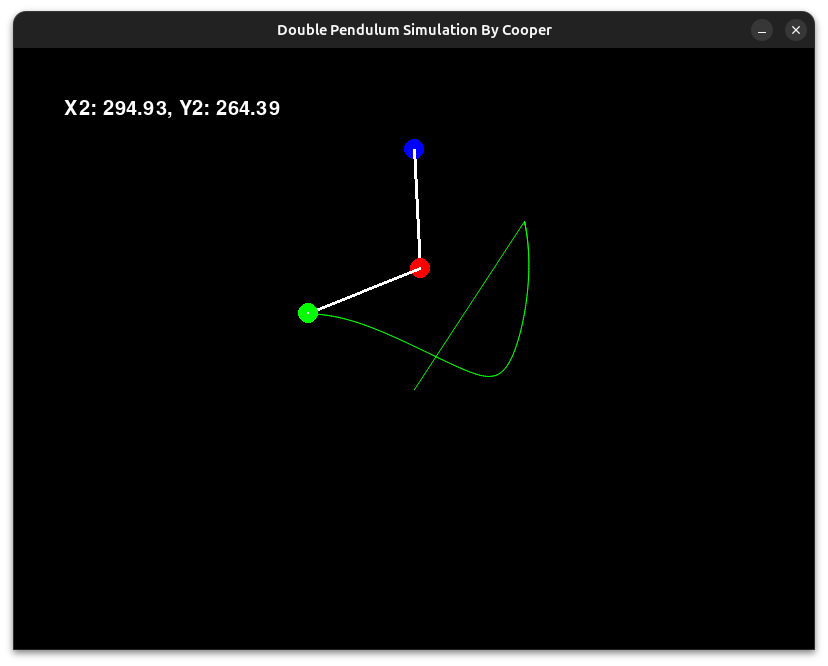

# Double Pendulum Simulation

An exciting simulation of Double Pendulum. It's just so cool to simulate physics stuff.



### Installation
- Download the latest release
- Execute the file

## Build from Source
- Clone the repo
- ```bash
  pip install pygame
  ```
- Run the app
  ```bash
  python3 main.py
  ```

### How to use

Hold the green bob and drag it, you won't see it dragging but it does drag. Leave the mouse when you want and let it swing. and ENJOY

Press R to reset.
